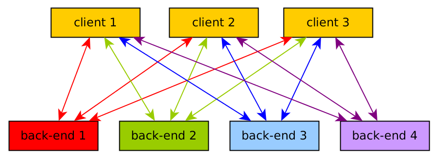
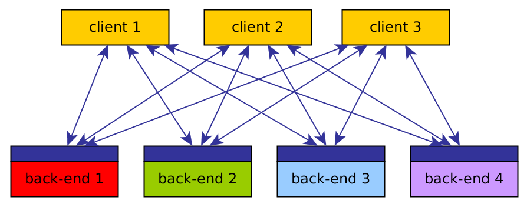
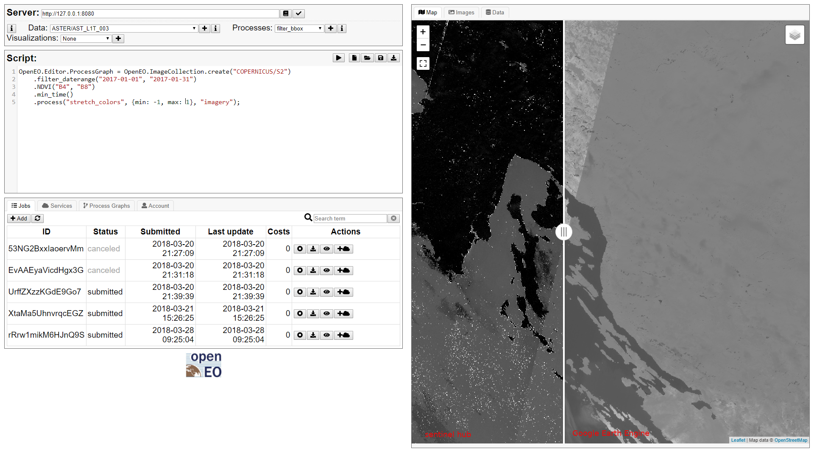

<!---
  ioslides_presentation:
    logo: rubic.jpg
--->

## Overview

* intro to data science with R
* openEO

```{r setup, include=FALSE}
knitr::opts_chunk$set(echo = TRUE)
knitr::opts_chunk$set(collapse = TRUE)
```

## Why do data analysts use R?

```{r}
0/0
```
R properly handles, and propagates, missing values (`NA`: not available), for all basic types
```{r}
x = c(3, NA, 2) + 5
x
x > 7
mean(x)
mean(x, na.rm = TRUE)
```

## openEO: the problem

* Earth Observation data is now mostly free, but too large to download
* Google Earth Engine is magnificent, but
    - not open source
    - not extendible
	- may disappear
* Other cloud platforms handling big EO data are mostly under construction
* With several different cloud platforms, 

## openEO: an API

```{r,out.width='60%',echo=FALSE}

```
```{r,out.width='60%',echo=FALSE}

```

----

```{r,out.width='100%',echo=FALSE}

```

## openEO: why not building on OGC standards?

* WPS: 
    - we can't do with "one process", we want _any_ process (like an R or Python script), described by a process graph
	- expects the data to be part of a WPS call
* WCPS: seems to be too much tied to one implementation, handled by a single person
* OGC standards should follow demonstrated and useful open source implementations, rather than prescribing what should be implemented

## big EO data and R?

* Clients: Python, R, javascript (library, web editor)
* back-ends: Sentinel Hub, GeoTrellis/GeoPySpark, JEO DPP, Sentinel Hub, WCPS, Google Earth Engine
* data model: vector- and raster-datacubes
* processes: math ops, reduce dimensions, vector/raster integration (sampling, aggregation)
* UDF's: apply (map) arbitrary processes (e.g. in Python or R code) to cube dimensions

* API pretty much done
* implementing back-ends in full swing
* presentations/demos in September (OpenGeoHub summer school, $\phi$-week)

## Concluding

* data science is a lively, young field with lots of exciting ideas and original approaches
* R is one of the major languages for data science
* R seems to pretty much on the lead in _spatial_ data science
* thinking that R competes with other languages is not helping the discussion
* interoperability is an important goal for open science, there's much to do 
* cloud platform lock-in and open standards lock-in need to be avoided 
